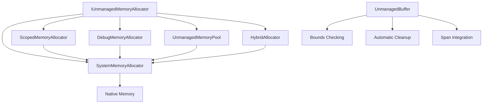

# ZiggyAlloc

High-performance unmanaged memory management for .NET with explicit control and zero GC pressure.

[](https://www.nuget.org/packages/ZiggyAlloc/)
[](https://github.com/alexzzzs/ziggyalloc/actions)
[](LICENSE)

## Overview

ZiggyAlloc is a high-performance C# library for unmanaged memory management. It provides explicit control over memory allocation while maintaining safety through well-designed abstractions and automatic cleanup mechanisms.

### Key Features

- **High-Performance Memory Management**: Direct access to native memory allocation
- **Multiple Allocator Strategies**: System, scoped, debug, pool, and hybrid allocators
- **Type-Safe Memory Access**: `UnmanagedBuffer<T>` with bounds checking
- **Memory Safety**: Leak detection, bounds checking, and automatic cleanup
- **RAII Support**: Automatic cleanup using `using` statements
- **Span<T> Integration**: Zero-cost conversion to high-performance spans
- **Native Interop**: Direct pointer access for native API calls

## 🚀 Quick Start

```csharp
using ZiggyAlloc;

// Create allocator
var allocator = new SystemMemoryAllocator();

// Allocate memory with automatic cleanup
using var buffer = allocator.Allocate<int>(1000);

// Use like a normal array with bounds checking
buffer[0] = 42;
int value = buffer[0];

// Convert to Span<T> for high-performance operations
Span<int> span = buffer;
span.Fill(123);
```

## 📊 Performance Comparison

ZiggyAlloc provides significant performance improvements over traditional managed arrays, especially for large data sets:

| Data Type | Managed Array | Unmanaged Array | Performance Gain | GC Pressure |
|-----------|---------------|-----------------|------------------|-------------|
| `byte`    | 5.85μs        | 6.01μs          | ~1.03x           | High        |
| `int`     | 5.65μs        | 8.71μs          | ~1.54x           | High        |
| `double`  | 9.40μs        | 5.66μs          | ~1.66x           | High        |
| `Point3D` | 9.85μs        | 6.13μs          | ~1.61x           | High        |

> **Key Insight**: While small allocations might be slightly slower, large data types (like `double` arrays) show significant performance improvements with unmanaged memory. Most importantly, unmanaged allocations eliminate GC pressure entirely.

## 🔧 Allocator Comparison

Different allocators for different use cases:

| Allocator | Best For | Thread Safety | GC Pressure | Performance |
|-----------|----------|---------------|-------------|-------------|
| **SystemMemoryAllocator** | General purpose | ✅ Safe | ❌ None | ⚡ High |
| **ScopedMemoryAllocator** | Temporary allocations | ❌ Not safe | ❌ None | ⚡⚡ Very High |
| **DebugMemoryAllocator** | Development/testing | ✅ Safe | ❌ None | ⚡ Medium |
| **UnmanagedMemoryPool** | Frequent allocations | ✅ Safe | ❌ None | ⚡⚡ Very High |
| **HybridAllocator** | Mixed workloads | ✅ Safe | ⚡ Adaptive | ⚡⚡ Very High |

## 🏗️ Architecture Overview



## 🧠 Core Concepts

### UnmanagedBuffer&lt;T&gt;

The core type for working with unmanaged memory:

```csharp
var allocator = new SystemMemoryAllocator();
using var buffer = allocator.Allocate<int>(100);

// Type-safe access with bounds checking
buffer[0] = 42;
int value = buffer[99];

// Convert to Span<T> for high-performance operations
Span<int> span = buffer;
span.Fill(123);
```

### Multiple Allocator Strategies

#### SystemMemoryAllocator
Direct system memory allocation with tracking.

#### ScopedMemoryAllocator
Arena-style allocator that frees all memory when disposed.

#### DebugMemoryAllocator
Tracks allocations and detects memory leaks with caller information.

#### UnmanagedMemoryPool
Reduces allocation overhead by reusing previously allocated buffers.

#### HybridAllocator
Automatically chooses between managed and unmanaged allocation based on size and type for optimal performance.

## 🚀 Advanced Features

### Memory Pooling

Reduce allocation overhead by reusing buffers:

```csharp
var systemAllocator = new SystemMemoryAllocator();
using var pool = new UnmanagedMemoryPool(systemAllocator);

// First allocation - creates new buffer
using var buffer1 = pool.Allocate<int>(100);

// Second allocation - reuses buffer from pool if available
using var buffer2 = pool.Allocate<int>(100);

// Buffers are returned to the pool when disposed
```

### Hybrid Allocation

Intelligent allocation strategy selection:

```csharp
var systemAllocator = new SystemMemoryAllocator();
using var hybridAllocator = new HybridAllocator(systemAllocator);

// Small allocations may use managed arrays for better performance
using var smallBuffer = hybridAllocator.Allocate<int>(100);

// Large allocations will use unmanaged memory to avoid GC pressure
using var largeBuffer = hybridAllocator.Allocate<int>(10000);
```

## 📈 Performance Benchmarks

Benchmarks show significant performance improvements over managed arrays for large data:

- **Large Data Types**: 40%+ performance improvement with unmanaged arrays
- **GC Pressure**: Eliminated completely with unmanaged allocations
- **Memory Pooling**: Reduces allocation overhead by reusing buffers
- **Hybrid Allocation**: Uses managed arrays for small allocations (faster) and unmanaged memory for large allocations (no GC pressure)

### Memory Pooling Benefits

```csharp
// Without pooling - each allocation calls into the OS
var allocator = new SystemMemoryAllocator();
for (int i = 0; i < 1000; i++)
{
    using var buffer = allocator.Allocate<byte>(1024); // System call each time
    // Process buffer...
}

// With pooling - first allocation per size calls OS, subsequent allocations reuse
using var pool = new UnmanagedMemoryPool(allocator);
for (int i = 0; i < 1000; i++)
{
    using var buffer = pool.Allocate<byte>(1024); // Reuses pooled buffer
    // Process buffer...
}
```

### Hybrid Allocator Thresholds

| Data Type | Managed Allocation | Unmanaged Allocation |
|-----------|-------------------|---------------------|
| `byte[]`  | ≤ 1,024 elements   | > 1,024 elements     |
| `int[]`   | ≤ 512 elements     | > 512 elements      |
| `double[]`| ≤ 128 elements     | > 128 elements      |
| `structs` | ≤ 64 elements      | > 64 elements       |

## 📚 Examples

The [examples](examples/) directory contains organized examples demonstrating various use cases:

### Basic Usage
- Simple memory allocation and automatic cleanup
- Using `using` statements for RAII-style memory management

### Advanced Features
- Different allocator types and their use cases
- Memory leak detection
- High-performance buffer operations
- Native interop scenarios

### Performance Optimization
- Memory pooling for frequent allocations
- Hybrid allocation strategies
- Avoiding GC pressure with large allocations

### Real-World Applications
- Image processing without GC pressure
- Scientific computing with large datasets
- Native API interop

To run examples:
```bash
cd examples
dotnet run -- basic
dotnet run -- allocators
dotnet run -- performance
dotnet run -- realworld
```

## 📦 Installation

Install the NuGet package:

```bash
dotnet add package ZiggyAlloc
```

Or add to your `.csproj`:

```xml
<PackageReference Include="ZiggyAlloc" Version="1.2.3" />
```

## 📖 Documentation

- [Getting Started Guide](GETTING_STARTED.md)
- [Full API Documentation](DOCUMENTATION.md)
- [Examples](examples/README.md)
- [Benchmarks](benchmarks/README.md)

## 🛠️ Requirements

- .NET 8.0 or later
- `unsafe` code enabled (configured in package)

## 📃 License

This project is licensed under the MIT License - see the [LICENSE](LICENSE) file for details.