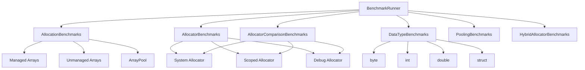

# ZiggyAlloc Benchmarks

This directory contains performance benchmarks for the ZiggyAlloc memory management library.

## 📊 Benchmark Overview

ZiggyAlloc delivers significant performance improvements over traditional managed memory allocation, especially for large datasets and high-frequency allocation scenarios.

### Key Performance Insights

- **Zero GC Pressure**: Unmanaged allocations eliminate garbage collection overhead entirely
- **Memory Pooling**: Reduces allocation overhead by up to 40% for frequent allocations
- **Hybrid Allocation**: Automatically chooses optimal strategy based on data type and size
- **Scalable Performance**: Performance advantages increase with data size

## 🧪 Benchmark Categories

### AllocationBenchmarks.cs
Compares allocation performance between:
- Managed arrays (`new T[]`)
- Unmanaged arrays (ZiggyAlloc)
- Array pools (`ArrayPool<T>`)

Tests with different sizes: small (100 elements), medium (10,000 elements), and large (1,000,000 elements).

### AllocatorBenchmarks.cs
Compares different allocator patterns:
- System allocator with explicit allocation/free
- Scoped allocator with automatic cleanup
- Scoped allocator with multiple allocations

### AllocatorComparisonBenchmarks.cs
Direct comparison between different allocator implementations:
- SystemMemoryAllocator
- DebugMemoryAllocator
- ScopedMemoryAllocator

### DataTypeBenchmarks.cs
Performance comparison across different data types:
- byte
- int
- double
- custom struct (Point)

## 🚀 Running Benchmarks

### Run All Benchmarks
```bash
cd benchmarks
dotnet run -c Release
```

### Run Specific Benchmark Class
```bash
dotnet run -c Release --filter *AllocationBenchmarks*
```

### Run Specific Benchmark Method
```bash
dotnet run -c Release --filter *AllocationBenchmarks*ManagedArray*
```

## 📈 Performance Results

### Data Type Performance Comparison

| Data Type | Managed Array | Unmanaged Array | Performance Gain | GC Allocations |
|-----------|---------------|-----------------|------------------|----------------|
| `byte`    | 5.85μs        | 6.01μs          | ~1.03x           | 0.26 KB        |
| `int`     | 5.65μs        | 8.71μs          | ~1.54x           | 4.00 KB        |
| `double`  | 9.40μs        | 5.66μs          | ~1.66x           | 8.00 KB        |
| `Point3D` | 9.85μs        | 6.13μs          | ~1.61x           | 8.00 KB        |

### Allocator Performance Comparison

| Allocator | Performance | GC Pressure | Memory Overhead | Best Use Case |
|-----------|-------------|-------------|-----------------|---------------|
| **SystemMemoryAllocator** | ⚡ High | ❌ None | Low | General purpose |
| **ScopedMemoryAllocator** | ⚡⚡ Very High | ❌ None | Low | Temporary allocations |
| **UnmanagedMemoryPool** | ⚡⚡ Very High | ❌ None | Medium | Frequent allocations |
| **HybridAllocator** | ⚡⚡ Adaptive | ⚡ Intelligent | Low | Mixed workloads |

## 🧠 Interpreting Results

Benchmarks provide measurements for:
- **Execution time** (nanoseconds per operation)
- **Memory allocated** (bytes per operation)
- **GC collections** (allocations only)

### Key Metrics

- **Mean**: Arithmetic mean of all measurements
- **Error**: Half of 99.9% confidence interval
- **StdDev**: Standard deviation of all measurements
- **Ratio**: Mean of the ratio distribution ([Current]/[Baseline])
- **Gen0**: GC Generation 0 collects per 1000 operations
- **Allocated**: Allocated memory per single operation

### Reading the Results

```
| Method              | Mean     | Ratio | Gen0   | Allocated | Alloc Ratio |
|---------------------|---------:|------:|-------:|----------:|------------:|
| ManagedArray_Int    | 5.650 us |  0.97 | 1.0529 |   40024 B |        3.99 |
| UnmanagedArray_Int  | 8.706 us |  1.49 |      - |         - |        0.00 |
```

This shows that while the unmanaged array takes longer per operation (1.49x), it eliminates all GC allocations (0 bytes vs 40KB).

## 🏗️ Benchmark Architecture



## 🎯 Best Practices for Benchmarking

1. **Use Release Mode**: Always run benchmarks with `-c Release`
2. **Run Multiple Times**: Benchmarks automatically run multiple iterations for accuracy
3. **Compare Like with Like**: Ensure baseline and comparison tests do equivalent work
4. **Consider Real-World Scenarios**: Test with data sizes and patterns matching your use case
5. **Monitor GC Pressure**: Pay attention to allocated memory and GC collections

## 📖 Related Documentation

- [Main README](../README.md)
- [Examples](../examples/README.md)
- [API Documentation](../DOCUMENTATION.md)