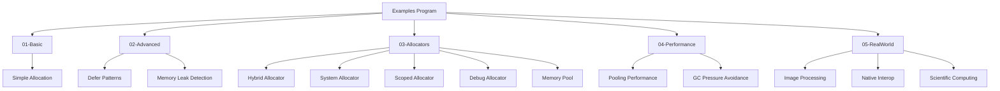

# ZiggyAlloc Examples

This directory contains organized examples demonstrating various use cases of ZiggyAlloc.

## 🗂️ Organization

The examples are organized into the following categories:

### 01-Basic
Fundamental usage examples for getting started with ZiggyAlloc.

- `01-SimpleAllocation.cs` - Basic memory allocation and usage

### 02-Advanced
Advanced features and patterns.

- `DeferPatterns.cs` - Advanced defer patterns and error handling
- `MemoryLeakDetection.cs` - Memory leak detection with DebugMemoryAllocator 

### 03-Allocators
Examples specific to different allocator types.

- `HybridAllocatorExample.cs` - Demonstrates the enhanced HybridAllocator

### 04-Performance
Performance optimization techniques and benchmarks.

- `UnmanagedMemoryPoolExample.cs` - Shows how to use memory pools for improved performance

### 05-RealWorld
Real-world application scenarios.

- `ImageProcessingExample.cs` - Image processing without GC pressure

## 🚀 Running Examples

### 1. Run the main examples program with arguments:
```bash
cd examples
dotnet run -- basic
dotnet run -- allocators
dotnet run -- performance
dotnet run -- realworld
```

### 2. Run individual example projects:
```bash
cd examples/01-Basic
dotnet run

cd examples/03-Allocators
dotnet run
```

### 3. Run the original examples:
```bash
cd examples
dotnet run
# Then follow the prompts to run specific example categories
```

## 📊 Example Performance Comparison

Different examples showcase various performance characteristics:

| Example Category | Performance Benefit | GC Pressure | Use Case |
|------------------|---------------------|-------------|----------|
| **Basic Allocation** | Moderate | ❌ Eliminated | Learning fundamentals |
| **Advanced Patterns** | High | ❌ Eliminated | Complex memory management |
| **Allocator Types** | Very High | ❌ Eliminated | Choosing right allocator |
| **Performance Optimization** | Maximum | ❌ Eliminated | High-performance scenarios |
| **Real-World Applications** | Contextual | ❌ Eliminated | Production use cases |

## 📘 Example Descriptions

### Basic Examples
These examples demonstrate fundamental ZiggyAlloc concepts:
- Simple memory allocation and automatic cleanup
- Using `using` statements for RAII-style memory management
- Converting buffers to `Span<T>` for high-performance operations

### Allocator Examples
These examples show the different allocator types:

#### HybridAllocator
Automatically chooses between managed and unmanaged allocation based on size and type

```csharp
var systemAllocator = new SystemMemoryAllocator();
var hybridAllocator = new HybridAllocator(systemAllocator);

// Small allocations may use managed arrays for better performance
using var smallBuffer = hybridAllocator.Allocate<int>(100);

// Large allocations will use unmanaged memory to avoid GC pressure
using var largeBuffer = hybridAllocator.Allocate<int>(10000);
```

#### SystemMemoryAllocator
Direct system memory allocation

#### ScopedMemoryAllocator
Arena-style allocation with automatic cleanup

#### DebugMemoryAllocator
Leak detection and debugging

#### UnmanagedMemoryPool
Reusing buffers to reduce allocation overhead

### Performance Examples
These examples demonstrate performance optimization techniques:

#### Memory Pooling Benefits
```csharp
// Without pooling - each allocation calls into the OS
var allocator = new SystemMemoryAllocator();
for (int i = 0; i < 1000; i++)
{
    using var buffer = allocator.Allocate<byte>(1024); // System call each time
    // Process buffer...
}

// With pooling - first allocation per size calls OS, subsequent allocations reuse
using var pool = new UnmanagedMemoryPool(allocator);
for (int i = 0; i < 1000; i++)
{
    using var buffer = pool.Allocate<byte>(1024); // Reuses pooled buffer
    // Process buffer...
}
```

#### Avoiding GC Pressure
- Large allocations using unmanaged memory
- Efficient buffer operations using `Span<T>`

### Real-World Examples
These examples show practical applications:

#### Image Processing Without GC Pressure
Process large images without triggering garbage collection:

```csharp
using var allocator = new SystemMemoryAllocator();
using var imageBuffer = allocator.Allocate<byte>(width * height * 4); // RGBA

// Process image data without GC pressure
Span<byte> imageData = imageBuffer;
for (int i = 0; i < imageData.Length; i += 4)
{
    // Manipulate pixel data
    imageData[i] = 255;     // Red
    imageData[i + 1] = 128; // Green
    imageData[i + 2] = 0;   // Blue
    imageData[i + 3] = 255; // Alpha
}
```

#### Native API Interop
Working with native APIs and raw pointers

#### Scientific Computing
Large datasets with mathematical operations

#### Custom Memory Layouts
Cache-friendly access patterns

## 🔧 Key Concepts Demonstrated

### 1. Automatic Memory Management
Using `using` statements and `Dispose()` patterns

### 2. Performance Optimization
Choosing the right allocator for the job

### 3. Interop
Working with native APIs and raw pointers

### 4. Safety
Bounds checking and type safety with `UnmanagedBuffer<T>`

### 5. Flexibility
Multiple allocation strategies for different scenarios

## 🏗️ Example Architecture



## 🎯 Learning Path

1. **Start with Basic Examples** - Understand fundamental concepts
2. **Explore Allocators** - Learn different allocation strategies
3. **Master Performance Techniques** - Optimize your applications
4. **Apply to Real-World Scenarios** - See practical implementations

## 📖 Related Documentation

- [Main README](../README.md)
- [Benchmarks](../benchmarks/README.md)
- [API Documentation](../DOCUMENTATION.md)