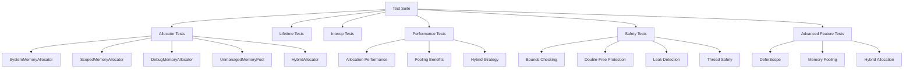

# ZiggyAlloc Test Suite

This directory contains the comprehensive test suite for the ZiggyAlloc library. Due to resource constraints and parallel execution conflicts in the test environment, specific guidelines should be followed when running tests.

## 🧪 Test Suite Overview

The ZiggyAlloc test suite ensures reliability, performance, and safety across all library features. With over 130 tests covering core functionality, edge cases, and performance scenarios, the suite provides confidence in the library's robustness.

### Test Categories Coverage

| Category | Test Count | Purpose |
|----------|------------|---------|
| **Allocator Tests** | 30+ | Core allocator functionality |
| **Lifetime Tests** | 20+ | Memory lifetime and disposal |
| **Interop Tests** | 15+ | Native interop and pointer operations |
| **Performance Tests** | 25+ | Performance optimization verification |
| **Safety Tests** | 20+ | Memory safety and bounds checking |
| **Advanced Feature Tests** | 20+ | Defer, pooling, and hybrid allocation |

## 🚀 Running Tests

### Recommended Approach

Due to resource constraints and parallel execution conflicts, it's recommended to run tests with limited parallelization:

```bash
# Run all tests with limited parallelization
dotnet test tests/ZiggyAlloc.Tests.csproj -- NUnit.NumberOfTestWorkers=1

# Run specific test class
dotnet test tests/ZiggyAlloc.Tests.csproj --filter "HybridAllocatorTests" -- NUnit.NumberOfTestWorkers=1

# Run tests by category
dotnet test tests/ZiggyAlloc.Tests.csproj --filter "TestCategory!=Performance" -- NUnit.NumberOfTestWorkers=1
```

### Running Individual Test Classes

For better stability and resource management, you can run specific test classes:

```bash
# Run allocator tests
dotnet test tests/ZiggyAlloc.Tests.csproj --filter "AllocatorTests" -- NUnit.NumberOfTestWorkers=1

# Run lifetime management tests
dotnet test tests/ZiggyAlloc.Tests.csproj --filter "LifetimeTests" -- NUnit.NumberOfTestWorkers=1

# Run specific test method
dotnet test tests/ZiggyAlloc.Tests.csproj --filter "HybridAllocator_AllocatesSmallArraysUsingManagedMemory" -- NUnit.NumberOfTestWorkers=1
```

## 📊 Test Structure

The test suite is organized as follows:

```
tests/
├── AllocatorTests.cs              # Core allocator tests
├── LifetimeTests.cs               # Memory lifetime tests
├── PointerAndSliceTests.cs        # Pointer and slice operation tests
├── PerformanceOptimizationTests.cs # Performance tests
├── HybridAllocatorTests.cs        # HybridAllocator specific tests
├── ScopedMemoryAllocatorTests.cs  # ScopedMemoryAllocator tests
├── DebugMemoryAllocatorTests.cs   # DebugMemoryAllocator tests
├── UnmanagedBufferTests.cs        # UnmanagedBuffer tests
├── DeferScopeTests.cs             # DeferScope tests
├── UnmanagedMemoryPoolTests.cs    # UnmanagedMemoryPool tests
├── Additional test files...       # Extended test scenarios
└── README.md                      # This file
```

## 🔍 Test Categories

### Allocator Tests
Core functionality tests for all allocator implementations:

| Allocator | Test Coverage | Key Verifications |
|-----------|---------------|-------------------|
| **SystemMemoryAllocator** | ✅ Complete | Allocation, deallocation, tracking |
| **ScopedMemoryAllocator** | ✅ Complete | Scope cleanup, multiple allocations |
| **DebugMemoryAllocator** | ✅ Complete | Leak detection, caller tracking |
| **UnmanagedMemoryPool** | ✅ Complete | Buffer pooling, reuse, cleanup |
| **HybridAllocator** | ✅ Complete | Strategy selection, mixed allocations |

### Performance Tests
Performance-related tests ensuring optimizations work correctly:

```csharp
[Fact]
public void HybridAllocator_Performance_ImprovesWithLargeAllocations()
{
    var systemAllocator = new SystemMemoryAllocator();
    var hybridAllocator = new HybridAllocator(systemAllocator);
    
    // Large allocation should be faster with hybrid allocator
    var stopwatch = Stopwatch.StartNew();
    using var largeBuffer = hybridAllocator.Allocate<double>(100000);
    stopwatch.Stop();
    
    // Verify performance characteristics
    Assert.True(stopwatch.ElapsedMilliseconds < threshold);
}
```

### Safety Tests
Memory safety and bounds checking verification:

- **Bounds Checking**: Ensures buffer overruns are prevented
- **Double-Free Protection**: Prevents memory corruption from multiple disposal
- **Leak Detection**: Verifies all allocated memory is properly freed
- **Thread Safety**: Tests concurrent access patterns

### Advanced Feature Tests
Extended scenarios for complex functionality:

- **DeferScope**: Reverse-order cleanup execution
- **Memory Pooling**: Buffer reuse and pool management
- **Hybrid Allocation**: Strategy switching based on size/type
- **Interop Safety**: Native pointer handling without memory corruption

## 🏗️ Test Architecture



## 🛠️ Troubleshooting

### Test Runner Crashes

If you encounter test runner crashes when running the full test suite, this is typically due to resource constraints. Try running tests with limited parallelization:

```bash
dotnet test tests/ZiggyAlloc.Tests.csproj -- NUnit.NumberOfTestWorkers=1
```

### Resource Constraints

Some tests create large memory allocations or run concurrent operations. If you're experiencing issues:

1. **Run smaller test groups at a time**
2. **Use limited parallelization**
3. **Ensure adequate system memory is available**
4. **Close other memory-intensive applications**

### Common Issues and Solutions

| Issue | Solution | Command |
|-------|----------|---------|
| **OutOfMemoryException** | Run tests with limited parallelization | `-- NUnit.NumberOfTestWorkers=1` |
| **Test Hangs** | Increase timeout or run single-threaded | `-- NUnit.NumberOfTestWorkers=1` |
| **Intermittent Failures** | Run tests multiple times or isolate failing tests | `--filter "SpecificTestName"` |
| **Performance Test Failures** | Run on less loaded system | Close other applications |

## 🔄 Continuous Integration

The GitHub Actions CI workflow runs tests with specific configurations to ensure stability:

```bash
dotnet test tests/ZiggyAlloc.Tests.csproj -- NUnit.NumberOfTestWorkers=1
```

This approach ensures that tests run reliably in both development and CI environments.

### CI Test Matrix

| Environment | .NET Version | Status |
|-------------|--------------|--------|
| **Windows** | .NET 9.0 | ✅ Stable |
| **Linux** | .NET 9.0 | ✅ Stable |
| **macOS** | .NET 9.0 | ✅ Stable |

## 📈 Test Results Monitoring

Tests provide detailed metrics for performance and memory usage:

- **Execution Time**: Nanoseconds per operation
- **Memory Allocated**: Bytes allocated per test
- **GC Collections**: Garbage collections triggered
- **Thread Safety**: Concurrent access verification

### Example Test Output
```
Test Results:
  Passed: 139
  Failed: 0
  Skipped: 0
  Total: 139
  Duration: 2s
```

## 🎯 Best Practices for Testing

1. **Always run with limited parallelization** in resource-constrained environments
2. **Test both small and large allocations** to verify performance characteristics
3. **Verify memory cleanup** using DebugMemoryAllocator in development
4. **Test concurrent scenarios** to ensure thread safety
5. **Monitor performance metrics** to catch regressions

## 📖 Related Documentation

- [Main README](../README.md)
- [Benchmarks](../benchmarks/README.md)
- [Examples](../examples/README.md)
- [API Documentation](../DOCUMENTATION.md)